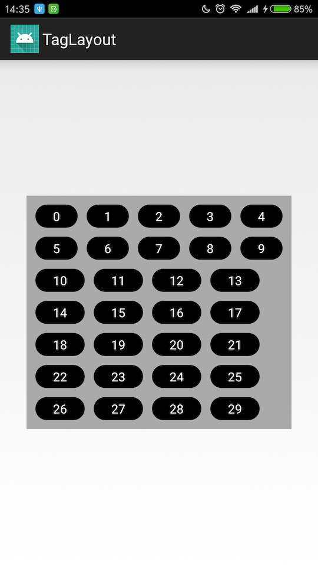

TagView 支持静态布局也支持代码动态布局

TagLayout 宽度不支持 wrap_content（wrap_content 等同于 match_parent）,高度所有模式都支持

````
<com.fffz.taglayout.TagLayout
    android:id="@+id/tag_layout"
    android:layout_width="300dp"
    android:layout_height="wrap_content"
    android:background="#aaaaaa"
    TagLayout:tagBackground="@drawable/bg_tag"
    TagLayout:tagHorizontalGap="5dp"
    TagLayout:tagPadding="5dp"
    TagLayout:tagPaddingLeft="20dp"
    TagLayout:tagPaddingRight="20dp"
    TagLayout:tagRadius="20dp"
    TagLayout:tagTextColor="#ffffff"
    TagLayout:tagTextSize="14dp"
    TagLayout:tagVerticalGap="10dp">
    <!--
            <com.fffz.taglayout.TagView
                android:layout_width="wrap_content"
                android:layout_height="wrap_content"
                android:background="@drawable/bg_tag"
                TagLayout:radius="5dp"
                TagLayout:text="我是标签1"
                TagLayout:textColor="#ffffff"
                TagLayout:textSize="12dp" />

            <com.fffz.taglayout.TagView
                android:layout_width="wrap_content"
                android:layout_height="wrap_content"
                android:background="@drawable/bg_tag"
                TagLayout:radius="5dp"
                TagLayout:text="我是标签2"
                TagLayout:textColor="#ffffff"
                TagLayout:textSize="12dp" />
    -->
</com.fffz.taglayout.TagLayout>
````

````
List<ITagEntity> tagEntities = ...
TagLayout tagLayout = findViewById(R.id.tag_layout);
tagLayout.setTagEntities(tagEntities);
tagLayout.setOnItemClickListener(new TagLayout.OnItemClickListener() {
    Toast mToast;

    @Override
    public void onItemClick(TagLayout parent, TagView view, int position, ITagEntity tagEntity) {
        if (mToast != null) {
            mToast.cancel();
        }
        mToast = Toast.makeText(parent.getContext(), tagEntity.getTagString(), Toast.LENGTH_SHORT);
        mToast.show();
    }
});
````

